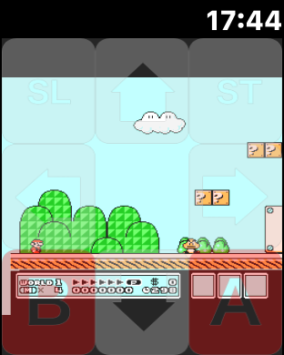
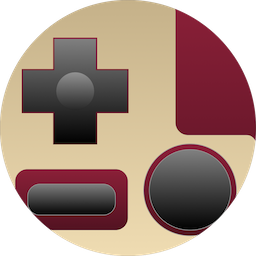

# NESEmulator-watchOS

NES Emulator on Apple Watch :space_invader: :watch:

## How to Run

1. Clone this repository
2. Execute `carthage update`
3. Prepare your own ROMs and add to project
4. Build and Run

This project will not launch on the simulator because of using `AVFoundation`.

## Requirements

- Xcode 8.2+
- watchOS 3.0+ 
- Carthage 0.18+
- Apple Watch Series 2 (Recommend)

## LICENSE

MIT License

This application depends on [FCEUX-watchOS](https://github.com/giginet/FCEUX-watchOS).
It's licensed under [Provenance License and OpenEmu License](https://github.com/giginet/FCEUX-watchOS/blob/master/LICENSE).
